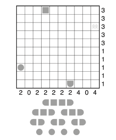

# Battleship Solitaire 6x6

This repository is made to version a school asignment. The asignment was given as part of an AI Algorithms lecture and is defined as followed:

## Exercise : Solving a 6×6 Battleship Solitaire Puzzle Using Constraint Satisfaction Problem (CSP)

In this exercise, you will write a program to solve Battleship Solitaire Puzzles by formulating it as a Constraint Satisfaction Problem (CSP). Battleship Solitaire is a single-player variant of the classic Battleship game. Unlike the two-player version, Battleship Solitaire provides hints on the number of ship segments within each row and column. Your goal is to deduce the exact placement and orientation of each ship segment on the grid.

### Game Rules

The rules for Battleship Solitaire are as follows:
<ul>
  <li>1. The puzzle is set on an N x N grid with a hidden fleet of ships. The fleet consists of:
  <ul>
    <li>Battleships: 4 cells long (1x4)</li>
    <li>Carriers: 3 cells long (1x3)</li>
    <li>Destroyers: 2 cells long (1x2)</li>
    <li>Submarines: 1 cell long (1x1)</li>
  </ul>
  </li>
  <li>
    2. Each cell in the grid represents either water (empty) or part of a ship.
  </li>
  <li>
    3. Ship shapes:
    <ul>
      <li>Battleships, carriers and destroyers are linear, occupying consecutive cells.</li>
      <li>Submarines occupy a single cell.</li>
      <li>Ships can be placed either horizontally or vertically but not dagonally.</li>
    </ul>
  </li>
  <li>4. Constraints provided:
  <ul>
    <li>Fleet constraints: Specifies the number of each type of ship in the fleet.</li>
    <li>Row and column constraints: Numbers at the left or right of each row and at the top or bottom of each column indicate the count of ships segments in that row or column.</li>
    <li>Hint constraints: Some cells may have predefined values, specifying either water or a specific ship segment.</li>
  </ul>
  </li>
  <li>
    5. Ships cannont touch each other,even diagonally. In other words, each ship must be srrounded by at least one cell of water on all sides, including corners.
  </li>
</ul>

### Task Overview

My task is to solve a 6x6 Battleship Solitaire Puzzle using CSP techniques. Specifically, I will:
<ul>
  <li>1. Program the CSP Solver, encoding the Battleship Solitaire Puzzle as a CSP.</li>
  <li>2. Optimize with Heuristics.</li>
  <li>3. Evaluate and compare the performances of the different solving methods.</li>
  <li>4. Implement a minimum conflicts Heuristics (eventually).</li>
</ul>

I may implement CSP search strategies like backtracking, forward checking and AC-3 arc consistency myself or use a constraint programming library as OR-Tools.

### Input Format

My program will be tested on various Battleship Solitaire puzzles. The input format is as follows:
<ul>
  <li>The first line describes the row constraints as a sequence of N=6 numbers. They're typically displayed on the left or the right of each row in puzzle examples.</li>
  <li>The second line describes the column constrants as a sequence of N=6 numbers. Typically shown at the top or bottom of each column in puzzle examples.</li>
  <li>The third line specifies the number of each type of ship. The for numbers represent the counts of submarines (3), destroyers (2), cruisers (1) and battleships (0), in that order.</li>
  <li>The remaining lines provide a 6x6 grid representing the initial puzzle layout. There are eight possible characters for each cell:
  <ul>
    <li>-'0' represents no hint provided for that square.</li>
    <li>-'S' represents a submarine.</li>
    <li>-'.' represents water.</li>
    <li>-'<' represents the left end of an horizontal ship.</li>
    <li>-'>' represents the right end of an horizontal ship.</li>
    <li>-'^' represents the top end of a vertical ship.</li>
    <li>-'v' represents the bottom end of a vertical ship.</li>
    <li>-'M' represents the middle segment of a ship, either horizontal or vertical.</li>
  </ul>
  </li>
</ul>

### Output format

The output should be a completed 6 × 6 grid representing the solution to the puzzle. Ensure there are no ’0’ characters remaining in the output. Each cell should display one of the seven possible values, indicating the correct placement of each ship segment.

